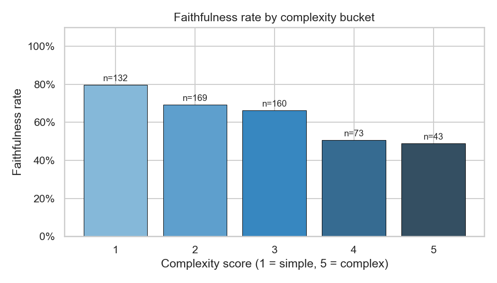
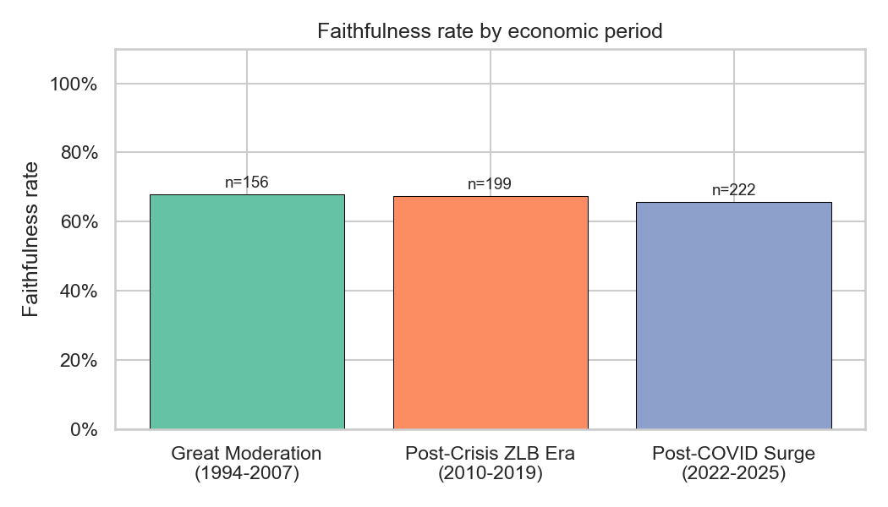
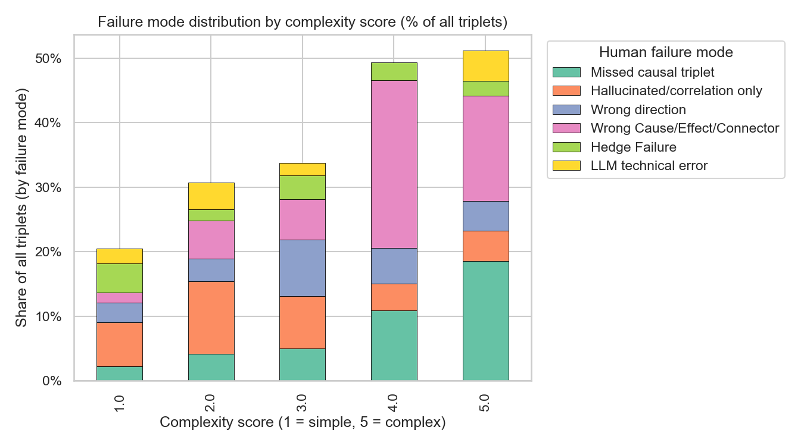
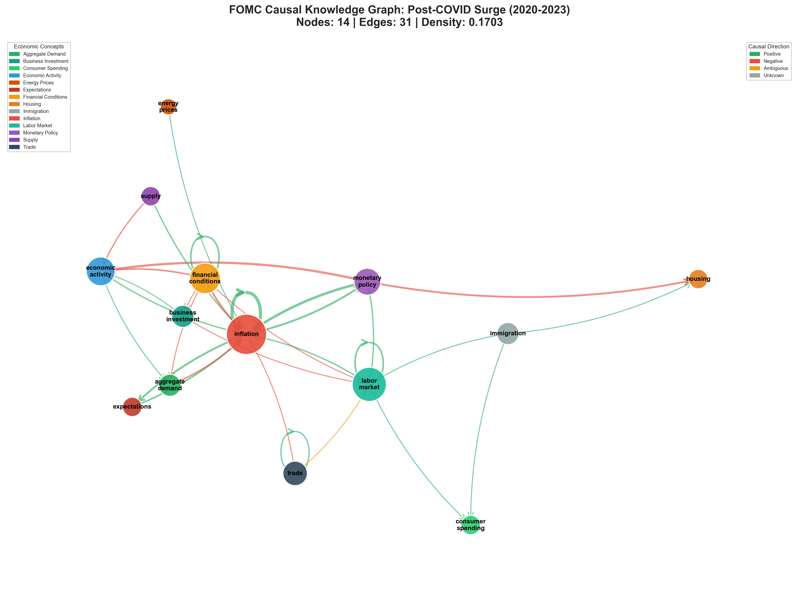

# LLM Faithfulness for Causal Extraction from FOMC Minutes

This project evaluates how reliably a large language model can extract **causal relationships** from Federal Reserve (FOMC) meeting minutes, and where it fails.

## Project Outcome (Paper Results)

- Dataset: **201 passages** from **30 FOMC meetings** across 3 economic regimes
- Human-validated causal triples: **577**
- Overall extraction faithfulness: **66.9%**
- Faithfulness on extracted-only triples: **73.1%**
- Core field accuracy (cause/connector/effect): **82.2%**
- Complexity effect: faithfulness drops from **79.5% (simple)** to **48.8% (most complex)**
- Across-regime stability: **65.8%–67.9%** (Great Moderation, Post-Crisis ZLB, Post-COVID)

## Key Result Visuals

### Faithfulness drops as linguistic complexity increases


### Faithfulness is stable across economic periods


### Failure modes by complexity


### Example causal knowledge graph (Post-COVID)


## Why This Matters

For applied AI in economics and finance, extraction quality is the difference between usable automation and misleading analysis.  
This work shows where LLM extraction is dependable, where human review is needed, and how complexity drives failure.

## What I Built

- End-to-end NLP pipeline for FOMC text ingestion, preprocessing, extraction, and evaluation
- Prompted causal extraction schema (`cause`, `connector`, `effect`, `hedge`, `direction`)
- Human evaluation workflow and error-mode analysis
- Period-level comparative analysis and knowledge graph outputs
- Reproducible analysis notebooks and chart generation

## Technical Stack

- **Python**, **Pandas**, **NLTK**, **Jupyter**
- **Gemini Batch API** (with optional OpenAI/GitHub model adapters)
- **NetworkX** for knowledge graph construction
- Config-driven pipeline via `config.yaml`

## Repository Structure

- `src/` – pipeline modules (data, extraction, judging, graph scripts)
- `notebooks/` – analysis and visualization notebooks
- `outputs/` – generated CSVs, figures, and graph artifacts
- `docs/` – manuscript support files (`acl.sty`, `acl_natbib.bst`, `references.bib`) and project docs
- `paper_draft.pdf` – final paper PDF

## Running the Pipeline

```bash
uv sync
uv run python -m src.data_pipeline
uv run python -m src.preprocessor
uv run python -m src.extractor
uv run python -m src.build_annotation_csv
```

Then run analysis notebooks in `notebooks/` (especially `03_analysis_and_viz.ipynb`).

