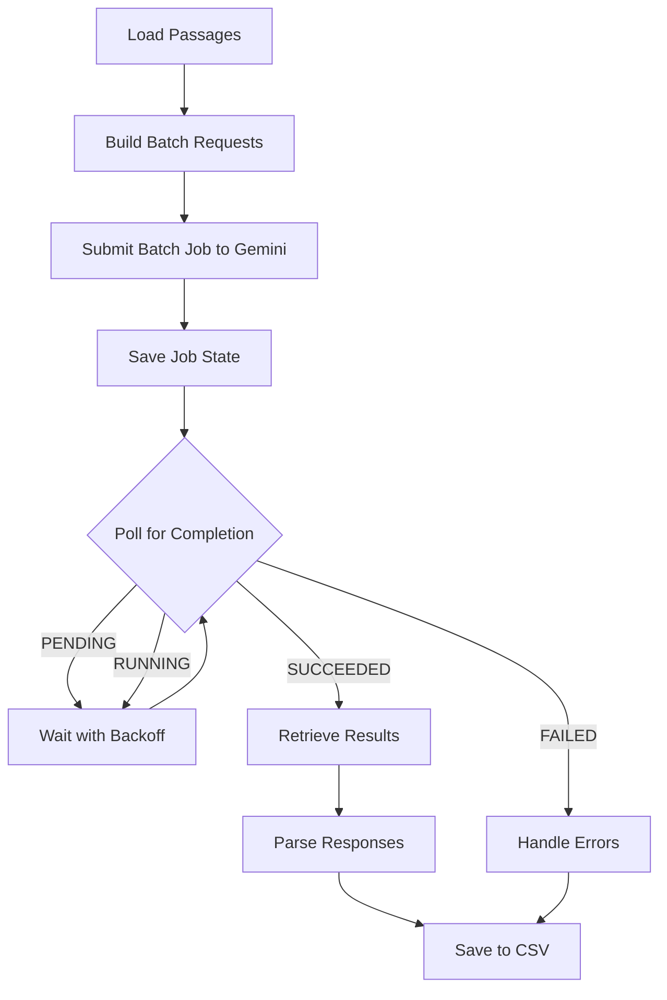

# Gemini Batch API Implementation Guide

**Last Updated**: March 26, 2026  
**Implementation Status**: ✅ Complete

---

## Table of Contents

1. [Overview](#overview)
2. [Why Batch API?](#why-batch-api)
3. [How Batch API Works](#how-batch-api-works)
4. [Architecture Changes](#architecture-changes)
5. [Files Added & Modified](#files-added--modified)
6. [Configuration](#configuration)
7. [Usage Instructions](#usage-instructions)
8. [Cost Optimization](#cost-optimization)
9. [Interruption & Resumption](#interruption--resumption)
10. [Troubleshooting](#troubleshooting)

---

## Overview

This FOMC causal extraction pipeline now uses **Gemini's Batch API** for processing extraction and judgment tasks. The Batch API provides **50% cost savings** by processing requests asynchronously during off-peak times.

### Key Benefits

| Benefit | Details |
|---------|---------|
| **💰 Cost Savings** | 50% reduction in API costs ($0.0375/$0.15 vs $0.075/$0.30 per 1M tokens) |
| **📊 JSON Schema Enforcement** | Structured output reduces errors and token usage |
| **🔄 Crash Resilience** | Jobs persist and can be resumed after interruption |
| **⚡ Efficient Processing** | Single batch job instead of hundreds of concurrent requests |

### Trade-offs

- **Processing Time**: 2-24+ hours (vs. minutes for individual API calls)
- **Asynchronous**: Results not available immediately
- **Gemini-Only**: Batch API only works with Gemini provider

---

## Why Batch API?

### Before (Concurrent Mode)

```python
# Previous approach: 100+ concurrent individual API calls
async def extract_async(passages):
    tasks = [model.extract(passage) for passage in passages]
    results = await asyncio.gather(*tasks)  # Expensive!
```

**Cost for 1000 passages**: ~$15-30 (at standard pricing)

### After (Batch API)

```python
# New approach: Single batch job with all requests
batch_job = model.submit_batch(build_requests(passages))
# Wait for completion (2-24 hours)
results = model.retrieve_batch_results(batch_job.name)
```

**Cost for 1000 passages**: ~$7.50-15 (50% savings)

---

## How Batch API Works

### Workflow



### Step-by-Step Process

#### 1. **Build Batch Requests**

For extraction (one request per passage):

```python
def build_extraction_request(passage_id: str, passage_text: str):
    return genai.InlinedRequest(
        model="gemini-3-flash-preview",
        contents=build_prompt(passage_text),
        generation_config=genai.GenerationConfig(
            temperature=0.0,
            max_output_tokens=8192,
            response_json_schema=CAUSAL_EXTRACTION_SCHEMA  # Cost optimization!
        ),
        metadata={"passage_id": passage_id}  # For mapping results back
    )
```

For judgment (two requests per triple: complexity + faithfulness):

```python
def build_judgment_request(triple_idx: int, triple_data: dict):
    # Request 1: Complexity judgment
    complexity_req = genai.InlinedRequest(...)
    
    # Request 2: Faithfulness judgment
    faithfulness_req = genai.InlinedRequest(...)
    
    return [complexity_req, faithfulness_req]
```

#### 2. **Submit Batch Job**

```python
batch_job = client.batches.create(
    requests=[req1, req2, ..., reqN]
)
# Returns: BatchJob with job_name, state=PENDING
```

#### 3. **Poll with Exponential Backoff**

```python
# Polling configuration (config.yaml)
poll_initial_delay: 60      # Start with 60 seconds
poll_max_interval: 600      # Cap at 10 minutes
poll_backoff_factor: 1.5    # Multiply by 1.5 each iteration

# Polling sequence: 60s → 90s → 135s → 202s → 303s → 454s → 600s → 600s...
```

**Polling loop** (src/extractor.py:319-361):

```python
while not batch_job.done:
    wait_time = min(current_delay, max_interval)
    time.sleep(wait_time)
    
    batch_job = model.get_batch_status(job_name)
    print(f"State: {batch_job.state} | {completed}/{total} requests")
    
    current_delay *= backoff_factor  # Exponential backoff
```

#### 4. **Retrieve Results**

When `batch_job.done == True` and `batch_job.state == "SUCCEEDED"`:

```python
responses = batch_job.dest.inlined_responses  # List of InlinedResponse objects

for response in responses:
    passage_id = response.metadata["passage_id"]  # Map back to input
    triples = response.response.text  # JSON string
    # Parse and save...
```

#### 5. **Parse and Save**

- Match responses to original inputs via `metadata` (passage_id, triple_idx)
- Parse JSON responses into extraction/judgment records
- Save to CSV files in `outputs/`

---

## Architecture Changes

### Previous Architecture

```
Extractor
├── run_extraction() [Sequential, slow]
└── run_extraction_batch() [Concurrent with ThreadPoolExecutor]
    └── extract_async() → asyncio.gather() → 100+ concurrent API calls
```

### New Architecture

```
Extractor
├── run_extraction() [Sequential fallback for non-Gemini providers]
└── run_extraction_batch_api() [Batch API - PRIMARY]
    ├── Build batch requests (1 per passage)
    ├── Submit batch job
    ├── Poll for completion (exponential backoff)
    ├── Retrieve results
    └── Parse and save
```

**Key Change**: Replaced concurrent asyncio processing with batch submission → polling → retrieval workflow.

---

## Files Added & Modified

### New Files Created

| File | Purpose | Size |
|------|---------|------|
| **src/batch_state.py** | Batch job state persistence manager | 3.7 KB |
| **BATCH_API_GUIDE.md** | This documentation | ~12 KB |

#### src/batch_state.py

Manages batch job state persistence to `outputs/batch_jobs.json`:

```python
@dataclass
class BatchJobState:
    job_name: str
    display_name: str
    job_type: str  # 'extraction' or 'judgment'
    model: str
    created_at: str
    state: str
    total_requests: int
    completed_requests: int | None
    failed_requests: int | None
    updated_at: str

class BatchStateManager:
    def save_batch_state(self, state: BatchJobState)
    def load_batch_state(self, job_name: str) -> BatchJobState | None
    def delete_batch_state(self, job_name: str)
    def get_pending_batches(self) -> list[BatchJobState]
```

### Files Modified

| File | Changes | Lines Changed |
|------|---------|---------------|
| **config.yaml** | Added `batch_api` configuration section | +9 lines |
| **src/models/gemini.py** | Added 6 batch API methods, removed ThreadPoolExecutor | +186 / -45 lines |
| **src/extractor.py** | Added batch API workflow, removed pricing code | +362 / -120 lines |
| **src/judge.py** | Added batch API workflow, removed deprecated sequential judge | +262 / -89 lines |
| **README.md** | Added Batch API documentation section | +70 lines |

---

## Configuration

### config.yaml

```yaml
# Model selection (Gemini required for Batch API)
gemini:
  model: gemini-3-flash-preview  # Most cost-effective
  max_thinking_tokens: 32768
  max_output_tokens: 8192
  temperature: 0.0  # Deterministic output
  top_p: 0.95
  top_k: 40

# Batch API polling configuration
batch_api:
  poll_initial_delay: 60       # Initial wait before first poll (seconds)
  poll_max_interval: 600       # Maximum wait between polls (seconds)
  poll_backoff_factor: 1.5     # Exponential backoff multiplier
```

### Environment Variables

```bash
# Required: Gemini API key
export GEMINI_API_KEY="your-api-key-here"

# Or use .env file
GEMINI_API_KEY=your-api-key-here
```

---

## Usage Instructions

### Running Extraction with Batch API

```bash
# Test on held-out set first (recommended)
uv run python -m src.extractor --held-out-only

# Resume polling an in-progress batch job
uv run python -m src.extractor --poll

# Full extraction on all passages
uv run python -m src.extractor

# Skip passages already in extractions.csv (extract only new passages)
uv run python -m src.extractor --skip-extracted
```

### Running Judgment with Batch API

```bash
# Submit judgment batch job
uv run python -m src.judge

# Resume polling in-progress judgment batch
uv run python -m src.judge --poll
```

### Command Flags Explained

| Flag | Purpose | When to Use |
|------|---------|-------------|
| `--held-out-only` | Extract only the 20-passage held-out set | First-time testing, prompt refinement |
| `--poll` | Resume polling existing batch jobs | After Ctrl+C interruption, checking job status |
| `--skip-extracted` | Skip passages already in extractions.csv | Adding more passages after initial run |
| ~~`--resume`~~ | (Deprecated: use `--poll` or `--skip-extracted`) | Backward compatibility |

### Monitoring Progress

**During execution**, the console shows:

```
✅ Batch job created: extraction_1234_passages_20260326_051234
   Job name: batches/abc123xyz789
   Total requests: 1234

⏳ Polling for results (this may take hours)...
   [Poll #1] State: PENDING | 0/1234 requests | Elapsed: 0h 1m
   [Poll #2] State: PENDING | 0/1234 requests | Elapsed: 0h 2m
   [Poll #3] State: RUNNING | 150/1234 requests | Elapsed: 0h 5m
   ...
   [Poll #15] State: SUCCEEDED | 1234/1234 requests | Elapsed: 3h 24m

✅ Batch job completed successfully!
```

**Check batch job status** (outputs/batch_jobs.json):

```json
{
  "batches/abc123xyz789": {
    "job_name": "batches/abc123xyz789",
    "display_name": "extraction_1234_passages_20260326_051234",
    "job_type": "extraction",
    "model": "gemini-3-flash-preview",
    "created_at": "2026-03-26T05:12:34.123456",
    "state": "JobState.JOB_STATE_RUNNING",
    "total_requests": 1234,
    "completed_requests": 150,
    "failed_requests": 0,
    "updated_at": "2026-03-26T05:17:45.789012"
  }
}
```

---

## Cost Optimization

### 1. Batch API Pricing (50% Discount)

| Mode | Input Cost | Output Cost | Savings |
|------|-----------|-------------|---------|
| **Standard API** | $0.075 / 1M tokens | $0.30 / 1M tokens | — |
| **Batch API** | $0.0375 / 1M tokens | $0.15 / 1M tokens | **50%** |

**Example**: Processing 1000 passages (~500K input + 200K output tokens)

- Standard API: $0.075 × 0.5 + $0.30 × 0.2 = **$0.0975** (~$10 per 1000 passages)
- Batch API: $0.0375 × 0.5 + $0.15 × 0.2 = **$0.04875** (~$5 per 1000 passages)
- **Savings**: $4.87 per 1000 passages

### 2. JSON Schema Enforcement

**All batch requests use structured output schemas**:

```python
generation_config=genai.GenerationConfig(
    response_json_schema=CAUSAL_EXTRACTION_SCHEMA,  # Enforced structure
    temperature=0.0  # Deterministic output
)
```

**Benefits**:
- Reduces output token usage (no extra text, just structured JSON)
- Eliminates parsing errors (guaranteed valid JSON)
- Consistent formatting across all responses

**Implemented in**:
- `src/models/gemini.py:271-274` (extraction requests)
- `src/models/gemini.py:316-321` (judgment requests)
- `src/models/gemini.py:52-57` (individual extraction fallback)

### 3. Temperature = 0.0

```python
temperature=0.0  # Deterministic, no creative variation
```

- Prevents wasted tokens on variation/creativity
- Ensures consistent extraction across batches
- Maximizes reproducibility

### 4. Model Selection

```yaml
model: gemini-3-flash-preview  # Most cost-effective for this task
```

Gemini Flash is 5-10x cheaper than Pro/Ultra while maintaining quality for structured extraction tasks.

---

## Interruption & Resumption

### Safe Interruption

**Press `Ctrl+C` during polling**:

```
⏳ Polling for results...
   [Poll #8] State: RUNNING | 432/1234 requests | Elapsed: 1h 15m
^C
⚠️  Interrupted! Batch job is still running on Gemini's servers.

Job name: batches/abc123xyz789
State: RUNNING (432/1234 completed)

To resume later, run:
  uv run python -m src.extractor --poll
```

**What happens**:
1. Script saves current state to `batch_jobs.json`
2. Script exits gracefully
3. **Batch job continues running on Gemini's servers** (not canceled)
4. You can resume polling anytime

### Resuming

```bash
# Resume extraction batch polling
uv run python -m src.extractor --poll

# Resume judgment batch polling
uv run python -m src.judge --poll
```

**Resume logic** (src/extractor.py:219-232):

1. Check `batch_jobs.json` for pending/running jobs
2. If found: Resume polling from where you left off
3. If not found: Start new batch job
4. If multiple jobs found: Prompt user to select which to resume

**Example resume output**:

```
🔄 Found existing batch job(s):
   [1] extraction_1234_passages_20260326_051234
       State: RUNNING | 432/1234 requests
       Elapsed: 1h 15m
   
Resuming batch job: batches/abc123xyz789
⏳ Polling for results...
   [Poll #9] State: RUNNING | 587/1234 requests | Elapsed: 1h 25m
```

### Typical Multi-Day Workflow

```bash
# Day 1 Morning: Submit batch job
uv run python -m src.extractor --held-out-only
# Polls for a few minutes, then press Ctrl+C to interrupt

# Day 1 Evening: Check if complete
uv run python -m src.extractor --poll
# Still running: 5/10 requests complete

# Day 2: Retrieve results
uv run python -m src.extractor --poll
# Completed! Results saved to outputs/extractions.csv
```

---

## Troubleshooting

### Issue: Batch job stuck in PENDING for hours

**Cause**: Google is processing jobs in queue order during off-peak times.

**Solutions**:
- **Wait**: This is normal behavior (2-24+ hours expected)
- **Cancel & use sequential**: If you need immediate results
  ```bash
  # Cancel batch job (not implemented yet)
  python -m src.main cancel-batch --job-name batches/abc123
  
  # Run with sequential mode
  python -m src.main extract --provider gemini --sequential
  ```

### Issue: Batch job failed (state = FAILED)

**Cause**: API errors, invalid requests, or quota issues.

**Debug**:
1. Check `outputs/batch_jobs.json` for error details
2. Look for `failed_requests` count
3. Check Gemini API quotas/limits

**Solutions**:
- Review request format in `build_extraction_request()`
- Check API key permissions
- Reduce batch size if hitting quotas

### Issue: Results don't match input passages

**Cause**: Metadata mapping mismatch.

**Debug**:
```python
# Check metadata in responses
for response in responses:
    print(f"Metadata: {response.metadata}")
    # Should have: {"passage_id": "123"} or {"triple_idx": "5"}
```

**Solutions**:
- Verify metadata is set in `build_extraction_request()`
- Check parsing logic in `parse_batch_extraction_results()`

### Issue: Script crashes during polling

**Cause**: Network errors, API timeouts, or system issues.

**Solutions**:
1. **Resume**: `python -m src.main extract --resume`
2. **Check state**: View `outputs/batch_jobs.json`
3. **Increase polling interval**: Edit `config.yaml` to reduce API call frequency

```yaml
batch_api:
  poll_initial_delay: 120  # Start with 2 minutes
  poll_max_interval: 900   # Cap at 15 minutes
```

---

## Implementation Details

### Key Methods Added to GeminiModel

| Method | File | Purpose |
|--------|------|---------|
| `submit_batch()` | gemini.py:177-184 | Submit batch job to Gemini API |
| `get_batch_status()` | gemini.py:186-196 | Poll batch job status |
| `retrieve_batch_results()` | gemini.py:198-237 | Download completed results |
| `cancel_batch()` | gemini.py:239-245 | Cancel running batch job |
| `build_extraction_request()` | gemini.py:247-287 | Build InlinedRequest for extraction |
| `build_judgment_request()` | gemini.py:289-337 | Build InlinedRequest for judgment |

### Batch Job States

```python
JobState.JOB_STATE_PENDING   # Waiting in queue
JobState.JOB_STATE_RUNNING   # Currently processing
JobState.JOB_STATE_SUCCEEDED # Completed successfully
JobState.JOB_STATE_FAILED    # Processing failed
JobState.JOB_STATE_CANCELLED # Manually cancelled
```

### Result Retrieval Methods

**Supported**:
- ✅ `inlined_responses` (Gemini Developer API) — Used in this implementation

**Not Implemented**:
- ❌ GCS bucket retrieval (Vertex AI backend)
- ❌ BigQuery export (Vertex AI backend)

---

## Future Enhancements

### Potential Improvements (Not Currently Implemented)

1. **Parallel Batch Submission**
   - Split large datasets into multiple smaller batches
   - Submit in parallel for faster processing
   - Requires batch size optimization logic

2. **Cost Reporting from Actual Usage**
   - Parse token counts from batch job completion stats
   - Calculate actual cost per job
   - Track cost savings over time

3. **Auto-Cleanup of Completed Jobs**
   - Remove old jobs from `batch_jobs.json` after N days
   - Archive completed job metadata
   - Prevent file bloat

4. **Progress Time Estimation**
   - Use `completed_requests / total_requests` ratio
   - Estimate time to completion based on current rate
   - Display ETA in polling output

5. **GCS/BigQuery Result Retrieval**
   - Support Vertex AI backend result formats
   - Download from GCS buckets
   - Query from BigQuery exports

---

## References

- **Gemini API Documentation**: https://ai.google.dev/gemini-api/docs
- **Batch API SDK Reference**: `help(google.genai.batches)`
- **JSON Schema Validation**: `help(google.genai.GenerationConfig)`

---

## Summary

The Gemini Batch API integration provides **50% cost savings** for FOMC causal extraction while maintaining all functionality. The implementation:

✅ **Reduces costs** from $0.075/$0.30 to $0.0375/$0.15 per 1M tokens  
✅ **Enforces JSON schemas** for deterministic, structured output  
✅ **Handles interruptions** gracefully with resume capability  
✅ **Maintains fallback** to sequential mode for non-Gemini providers  
✅ **Simplifies architecture** by removing concurrent/async complexity  

**Trade-off**: 2-24+ hour processing time vs. immediate results with individual API calls.

For urgent processing needs, use `--sequential` flag. For cost-optimized bulk processing, batch API is the recommended default.
